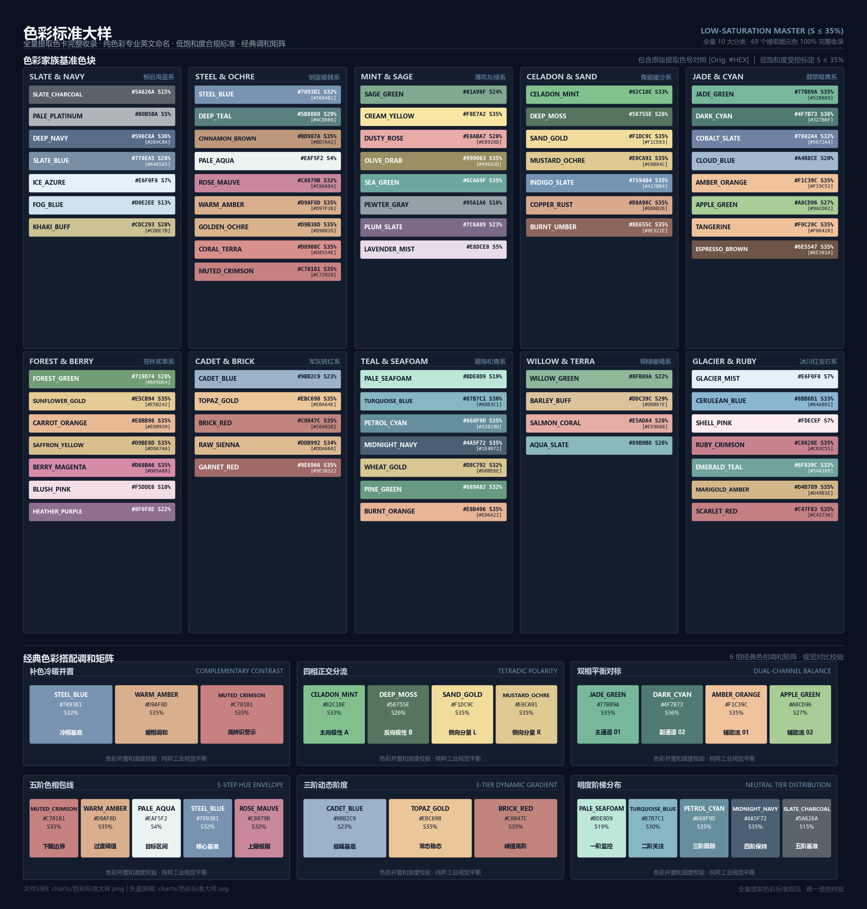

# 标准色彩库 (Standard Color Palette Library)

民航统计分析与工程图样受控标准色彩体系。



## 核心特性

- **全量 69 色受控收录**：涵盖 10 大分类家族、58 个图元色标与 6 组经典调和矩阵；
- **纯色彩学命名**：彻底脱钩民航专业代码，采用国际标准专业色彩英文命名（如 `STEEL_BLUE`, `JADE_GREEN`, `MUTED_CRIMSON`, `SAND_GOLD` 等）；
- **低饱和度工业标准**：全量色相严格收敛于 $S \le 35\%$ 工业克制区间；
- **多层调用架构**：支持点语法强类型自动补全、场景语义角色映射以及成套搭配矩阵；
- **运行时只读防篡改**：核心容器代码级只读阻断，非授权无法修改；
- **跨平台支持**：提供 Python 核心库、通用 JSON 数据字典与 CSS 根变量。

## 快速安装

### 方式一：通过 GitHub 在线直接安装
```bash
pip install git+https://github.com/xair330/standard-color-palette.git
```

### 方式二：本地离线或 Google 云盘安装
```bash
pip install "G:\我的云端硬盘\色彩标准库\dist\standard_color_palette-1.0.0-py3-none-any.whl"
```

## 使用指南

### 1. 点语法属性调用 (IDE 自动补全)
```python
import palette
from palette import C

# 绘制折线
ax.plot(x, y, color=C.STEEL_BLUE, label="主线")
ax.fill_between(x, y0, y1, color=C.PALE_AQUA, alpha=0.3)
```

### 2. 场景语义角色调用
```python
from palette import Roles

# 双通道平行对标
ax.plot(t, ch1, color=Roles.DualChannel.PRIMARY)    # JADE_GREEN
ax.plot(t, ch2, color=Roles.DualChannel.SECONDARY)  # DARK_CYAN
```

### 3. 经典调和搭配矩阵调用
```python
from palette import Harmonies

# 获取五阶包线色彩序列
for data, col in zip(lines, Harmonies.ENVELOPE_5):
    ax.plot(t, data, color=col)
```

### 4. Matplotlib 绘图样式一键注入
```python
import matplotlib.pyplot as plt
import palette

palette.apply_style()  # 自动收敛至 S <= 35% 低饱和度基准
```

## 色卡更新与管理规程

根据《标准色彩库管理规程》，本色彩库为受控只读资产。**任何色卡的增、删、改必须获得系统主管（用户）的显式书面批准授权**，严禁擅自修改。详见 `COLOR_GOVERNANCE_RULES.md`。
